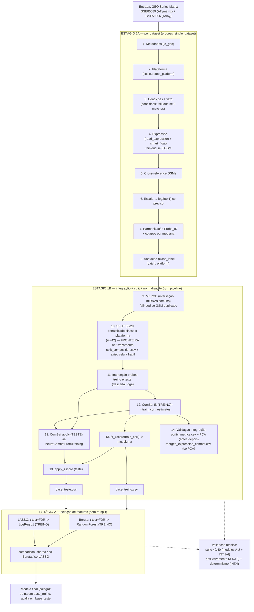

# Fluxograma do Pipeline

Reflete o código atual (pós-correção de vazamento). Etapas mapeadas para arquivo/função.

## Visão ASCII

```
═══════════════════════════════════════════════════════════════════════════════
  ENTRADA: arquivos GEO Series Matrix (.txt/.xlsx)
  GSE85589 (Affymetrix GPL19117)   +   GSE59856 (3D-Gene/Toray GPL18941)
═══════════════════════════════════════════════════════════════════════════════
                                    │
        ┌───────────────────────────┴───────────────────────────┐
        ▼                                                        ▼
  ESTÁGIO 1A — POR DATASET (dataset.process_single_dataset), em loop:
   │ 1. Metadados ......... io_geo.parse_series_metadata_tabular (encoding robusto)
   │ 2. Plataforma ........ scale.detect_platform (avisa se for mRNA, não miRNA)
   │ 3. Condições ......... conditions.* (filtro; FAIL-LOUD se 0 matches)
   │ 4. Expressão ......... expression.read_expression + smart_float
   │                        (FAIL-LOUD se 0 colunas GSM)
   │ 5. Cross-reference ... casa GSMs filtrados × colunas de expressão
   │ 6. Escala ............ scale.infer_scale → log2(x+1) se necessário
   │ 7. Harmonização ...... features.build_feature_map + canonicalize_probe_id
   │                        (colapsa Probe_IDs duplicados pela MEDIANA)
   │ 8. Anotação .......... features.build_sample_annotation
   │                        (class_label PDAC/Control/Unknown, batch, platform_id)
   ▼
  out_<GSE>/ (expression_merge_ready.csv, sample_annotation.csv, ...)
        │
        ▼
  ESTÁGIO 1B — INTEGRAÇÃO + SPLIT + NORMALIZAÇÃO (geo_mirna_pipeline.run_pipeline)
   │ 9.  MERGE ........... dataset.merge_datasets (interseção dos miRNAs comuns;
   │                       FAIL-LOUD se colunas GSM duplicadas)
   │                       → merged_expression_raw.csv + merged_sample_annotation.csv
   │ 10. SPLIT ◄════ FRONTEIRA ANTI-VAZAMENTO ════
   │       stratified_split_ids → 80/20 estratificado por CLASSE × PLATAFORMA (rs=42)
   │       → coluna 'split'; split_composition.csv
   │       [AVISO: célula de teste frágil <10 → ex. Affy·Control=4]
   │ 11. INTERSEÇÃO probes treino∩teste (descartar + logar; ANTES do fit)
   │            ┌───────────── TREINO ───────────┬──────── TESTE (intocado) ────┐
   │ 12. ComBat   combat_fit(treino)            combat_apply(teste)
   │              → train_corr, estimates ──────► neuroCombatFromTraining → test_corr
   │              (→ combat_estimates.pkl)
   │ 13. Z-score  fit_zscore(train_corr) → μ,σ ─► apply_zscore(treino e teste)
   │              (→ zscore_params.csv)
   │       → base_treino.csv                       → base_teste.csv
   │ 14. Validação da integração:
   │       merged_expression_combat.csv (treino+teste corrigidos — SÓ p/ PCA)
   │       purity_metrics.csv (PurityB/D, Silhouette) + PCA antes/depois
        │
        ▼
  ESTÁGIO 2 — SELEÇÃO DE FEATURES (run_feature_refinement_system, modo both)
  consome base_treino.csv / base_teste.csv (SEM re-split — split veio do Estágio 1)
   │   Boruta (refine_features_pdac)        LASSO (refine_features_lasso)
   │     Step A: Welch t-test + FDR(BH) + efeito   [TREINO]
   │     Step B: RandomForest (Boruta)  |  LogReg L1 (LASSO)   [TREINO]
   ▼
  comparison/ (shared / só-Boruta / só-LASSO)
   │
   ▼
  ► MODELO final (colega): treina em base_treino, avalia em base_teste intocado.

═══════════════════════════════════════════════════════════════════════════════
  VALIDAÇÃO TÉCNICA (não altera o pipeline; lê artefatos)
═══════════════════════════════════════════════════════════════════════════════
  • validation/test_module_a..j + test_integrated_flow → suíte 40/40
       J: anti-vazamento (perturbação atol=0 + IDs)
       INT.4: determinismo base_treino/teste + treino∩teste=∅
═══════════════════════════════════════════════════════════════════════════════
```

## Versão Mermaid



## Notas de fidelidade

- A **fronteira anti-vazamento** é o passo 10 (split antes de qualquer ComBat/z-score).
- ComBat e z-score são sempre **fit no treino / apply no teste**; mediana de imputação é train-only.
- `merged_expression_combat.csv` é **só artefato de PCA** — não alimenta o Estágio 2.
